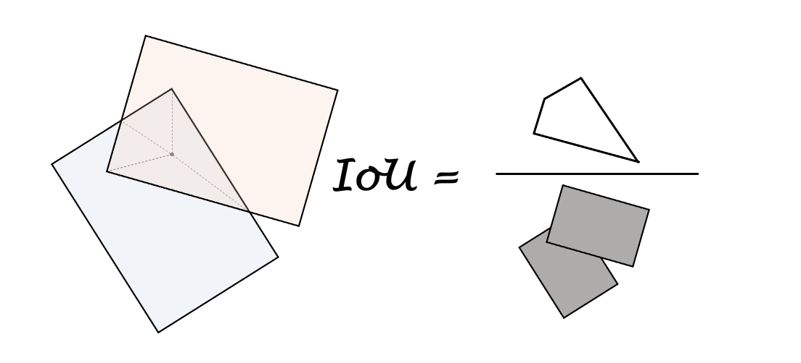

# Numiou: Num(py) IoU

A **light-weight** and **plug-and-play** intersection over union (IoU) library for object detection. just dependent on numpy. 

# Why do this
When i want to use some library to calculate rotated bounding boxes's IoU in my small project, there are two problems in front of me.
1. **fast but not easy-to-adapted**: i know some cool and fast iou implementation, but they are in some relatively large projects and have many dependencies.
2. **easy-to-use but too slow**: pure numpy implementation is hard to get a fast IoU calculattion.

So i made this one. just took a piece of code from OpenPCdet separately and adapted it into numpy. this meets my needs. And hope it can be useful to you.
# Use scope
- Numpy or C++: 
- Aplly to rotated, bev rectangles with (N,7) [x, y, z, dx, dy, dz, yaw] data fromate. 

# Installtion
```zsh
cd && git clone git@github.com:hova88/numiou.git
python3 -m pip install -r requirements.txt
python3 -m pip install -e . -vvv
```

# Usage
```python
import numpy as np 
import numiou as niou
boxes_a = np.ones((10,7))
boxes_b = np.ones((6,7))
iou = niou.bev(boxes_a,boxes_b)
print(iou)

```
